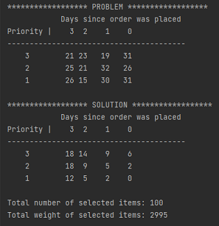
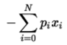
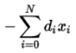
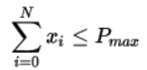

# Packing a Delivery Truck

In North America there are hundreds of standard box sizes that consumer goods can be
shipped in. Selecting and loading these different sized parcels onto delivery trucks 
makes for a very complex optimization problem, especially when other factors such as 
priority shipping and order date are considered. 

In this example we consider a simple scenario where we have a single truck and single 
box size. We want to choose packages to load onto the truck so that the number of 
packages with priority shipping status is maximized and the aggregate transit time is
minimized. The truck's weight and size capacity must not be exceeded.

## Usage
To run the example, type:

    python truck_packing_demo.py

The code will randomly generate a problem with 300 available packages with a weight between 
1 and 100 lbs. It generates two tables to show the problem and the results.

The upper left quadrant of the table contains the highest priority packages that have been
in transit for the longest. The solution should show more packages in the first column and 
row than the others. 

## Problem Formulation
This is a multi-objective and multi-constraint problem, so we will use the Constrained
Quadratic Model (CQM) hybrid solver to solve it. 

### Problem Parameters
The problem parameters are
- `N`:     the number of packages available
- `W_max`: the truck's maximum payload
- `P_max`: the maximum number of packages that can fit in the truck
- `p_i`:   priority for package i. The priority can be 1 (lowest), 2, or 3 (highest)
- `d_i`:   number of days that package i has been in transit

### Variables
This problem uses binary variables to indicate whether or not a package is selected.

`x_i` determines if package i is selected (`x_i = 1`) or not (`x_i = 0`)

### Objective
1. Maximize the number of packages with priority shipping status:

2. Minimize the total transit time across all packages:

### Constraints
1. The total weight of the packages cannot exceed the maximium weight capacity of the truck:

2. The total number of packages cannot exceed that which can fit on the truck:

